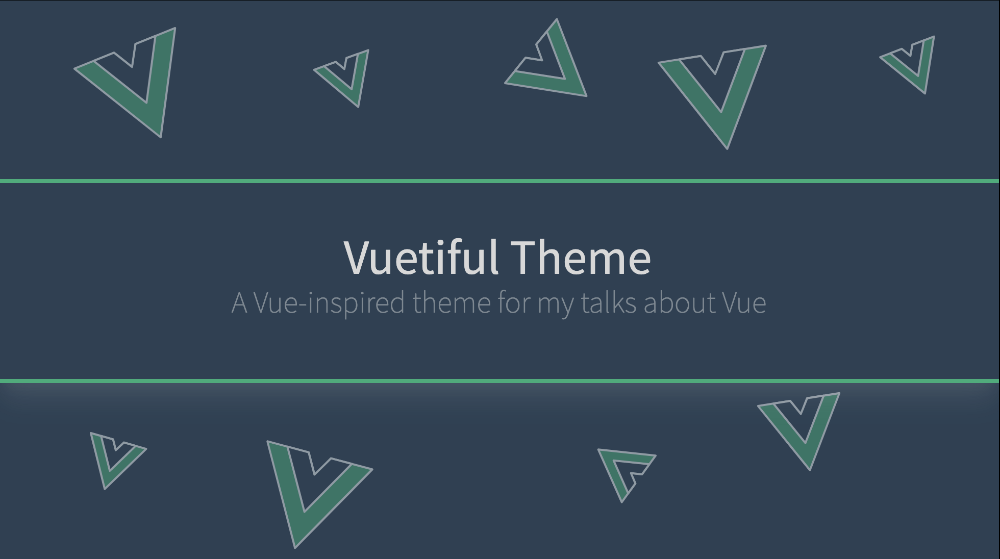
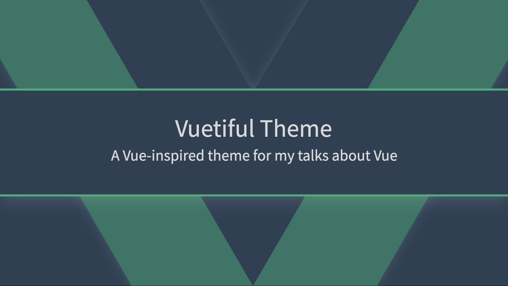
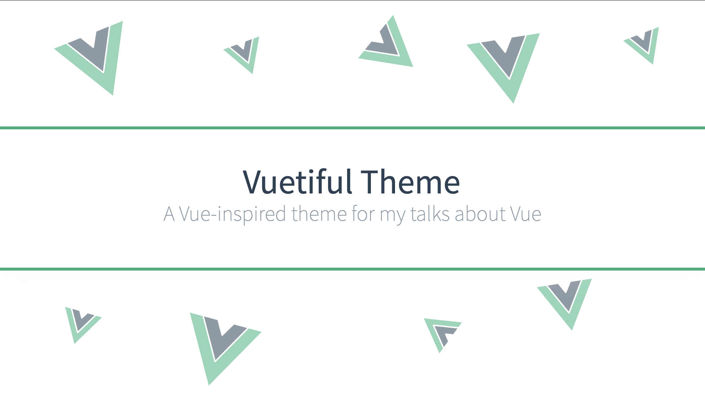
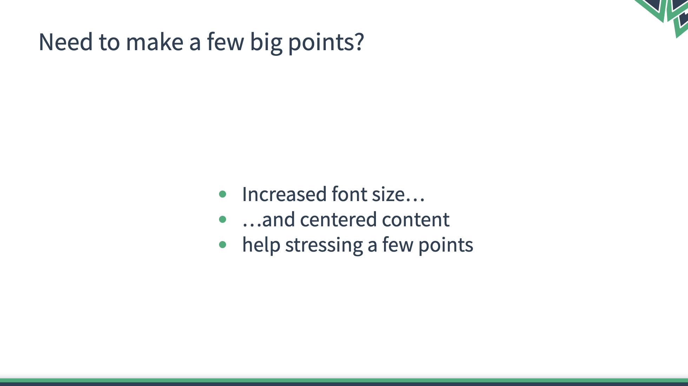
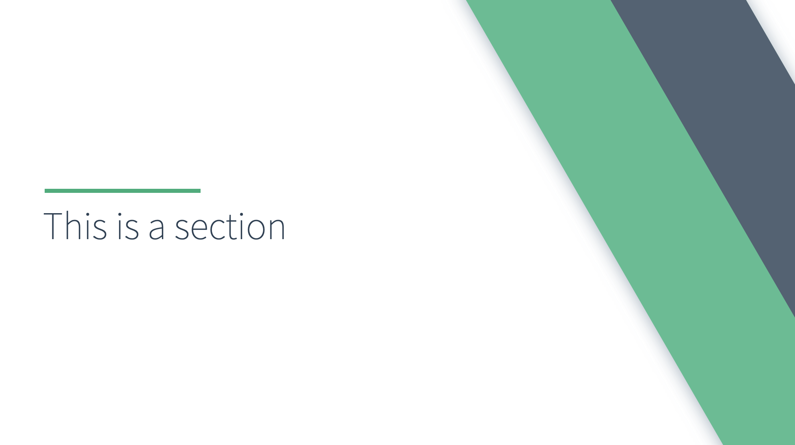
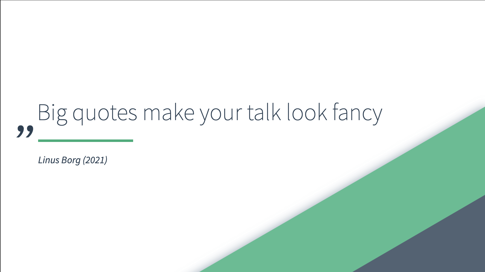
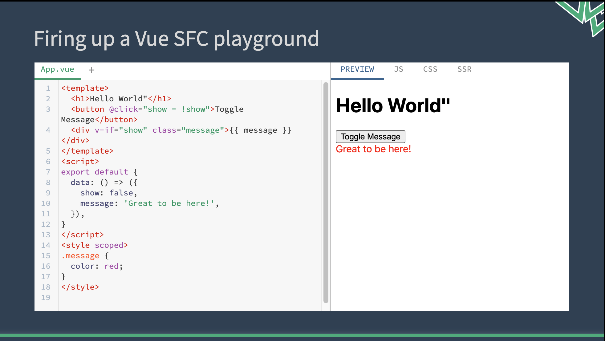

# slidev-theme-vuetiful

[](https://www.npmjs.com/package/slidev-theme-vuetiful)

A Vue-inspired theme for [Slidev](https://github.com/slidevjs/slidev).

Live demo: https://slidev-theme-vuetiful.netlify.app/

### Features

* Pretty Vue Theme
* Subtle Animations on Cover, Section etc. slides
* Code Highlighting with Sarah Drasner's Night Owl Theme
* SFC Playground Integration
* Flexible Default Layout using Grids
* 




## Install

Add the following frontmatter to your `slides.md`. Start Slidev then it will prompt you to install the theme automatically.

<pre><code>---
theme: <b>vuetiful</b>
---</code></pre>

Learn more about [how to use a theme](https://sli.dev/themes/use).

## Layouts

> Note: I'm still in the process of adding more slide variations.

This theme provides the following layouts:

 - Default (improved w/grid)
 - BigPoints
 - Cover
 - Section
 - Quote
 - SFC
 - Video
 - Outro

### Default

The default slide has a few tricks up it's sleeve.

It an of course be used as-is:

```
---

# This will be the heading

And this can be used as test below it

-  We can have a list.
- With a few items.

---

```

But it can also have the title in a special row:

```
---
title: This will now be the heading
titleRow: true
---

This content can now be styled/positioned independent of the title,
because it will be in a separate grid cell.

---
```

We can also do a quick column:

```
---
cols: 1-1 # Other values: 2-1 or 1-2, as well as any valid grid-cols-* class from windiwcss
---

This will go in the left column

:::right:::

This will go into the right column

---
```

You can also combine this with the separate titleRow:

```
---
title: This will span both columns
titleRow: true
cols: 2-1
---

This will be in the wider, left column

:::right:::

This will be in the smaller, right column

```

### Cover

A Cover slide for the Talk Title & Subtitle
#### Example

```frontmatter
---
layout: cover
cover: alt # to enable alternative cover
clicks: 1
---

# Vuetiful Theme
A Vue-inspired theme for my talks about Vue
```

> Note: the `clicks: 1` is necessary for the entry transition to work properly


<details>
<summary>Click for more screens</summary>

Default cover:



White alt cover:


</details>


### Big Points

This slide type is much like the default slide, the main difference is that the content font-size is bigger and the content in centered.

Useful for slides that just contain a few points or sentences.

#### Example


```frontmatter
---
layout: big-points
title: Need to make a few big points?
titleRow: true
---

- Increased font size...
- ...and centered content
- help stressing a few points

```



### Section

This slide can be used to split your talks into sections. It's meant to only have a single heading.



### Quote

Sometimes you want to drive home a point with a quote. This slide provides a nice way of doing that.

#### Example

```
---
layout: quote
author: Linus Borg (2021)
---

# Big quotes make your talk look fancy

---
```



### SFC (Single File Component Preview)

This template integrates the SF playground ([sfc.vuejs.org](https://sfc.vuejs.org)) which allows for live demos. It's usage requires a bit of preparation/config.


#### Config

```ts
// ./setup/main.ts
import { defineAppSetup } from '@slidev/types'

// use Vite's raw imports to get file content as string
// (see: https://vitejs.dev/guide/features.html#static-assets)
import Test from '../examples/Test.vue?raw'
import App from '../examples/App.vue?raw'
import Child from '../examples/Child.vue?raw'


interface Examples {
  [key: string]: string | {
    [key: string]: string
  }
}
const examples: Examples = {
  // for examples consisting of a single file, 
  // just pass its content as value
  // File will be named App.vue
  Test: Test,
  // to construct an example from multiple files,
  // or have a custom name for the file,
  // pass an object where each key is the filename 
  // and value is the file content string
  Multiple: {
    'App.vue': App,
    'Child.vue': Child,
  }
}

export default defineAppSetup(({ app }) => {
  // use app.provide to make all examples 
  // available to the SFC Slide implementation
  app.provide('sfc-examples', examples)
})
```

### Usage

```frontmatter
---
layout: sfc
example: Test 
---

# This will be the slide's title
```

#### Example



### Video


## Contributing

- `npm install`
- `npm run dev` to start theme preview of `example.md`
- Edit the `example.md` and style to see the changes
- `npm run export` to generate the preview PDF
- `npm run screenshot` to generate the preview PNG
